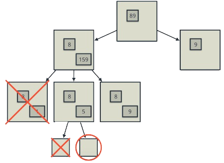

# Artificial Intelligence Nanodegree
## Introductory Project: Diagonal Sudoku Solver

This project implements solving of Sudoku puzzles using depth-first state-space
search and constraint propagation.

### Terminology

- The Sudoku board is called a `grid`. 
  A standard grid has `9` columns and `9` rows.
- Each cell in the grid is called a `box` and each box contains zero or one `digits`. 
  There are `81` boxes on a standard grid with the possible digits `1..9` each.
- Each row, column and `3x3` subgrid is called a `unit`. 
  There are `27` units on a standard grid.
- For each box, all other boxes appearing in the same unit are called `peers`. 
  For each box, there are `20` (distinct) peers on a standard grid.
- Each possible digit `1..9` for a box is a `candidate digit`.

### Goal of the game

Given some predetermined boxes, fill in all empty boxes with the correct digit, such
that each unit contains exactly one occurrence of each digit.
 
A starting grid might look as follows:

```
2     |      |      
      |    6 |2     
    1 |      |  7   
------+------+------
    6 |    8 |      
3     |  9   |    7 
      |6     |4     
------+------+------
  4   |      |8     
    5 |2     |      
      |      |    3 
```

Using only above rules, a valid solution would be:

```
2 3 9 |8 7 4 |1 5 6 
7 5 4 |3 1 6 |2 9 8 
6 8 1 |9 5 2 |3 7 4 
------+------+------
4 7 6 |1 2 8 |5 3 9 
3 1 2 |4 9 5 |6 8 7 
5 9 8 |6 3 7 |4 1 2 
------+------+------
1 4 3 |7 6 9 |8 2 5 
9 6 5 |2 8 3 |7 4 1 
8 2 7 |5 4 1 |9 6 3 
```

In general, more than one solution for the same board can exist.
 
An additional constraint, Diagonal Sudoku, can be placed such that the
the main diagonals form two additional units (such that every digit must
occur exactly once in them). Given this, a solution to the above board might
be:

```
2 6 7 |9 4 5 |3 8 1 
8 5 3 |7 1 6 |2 4 9 
4 9 1 |8 2 3 |5 7 6 
------+------+------
5 7 6 |4 3 8 |1 9 2 
3 8 4 |1 9 2 |6 5 7 
1 2 9 |6 5 7 |4 3 8 
------+------+------
6 4 2 |3 7 9 |8 1 5 
9 3 5 |2 8 1 |7 6 4 
7 1 8 |5 6 4 |9 2 3 
```

# Strategies and constraint propagation

Initially, each empty box of the grid may contain any of the candidate digits `1..9`.
Three general strategies are used to solve the Sudoku board:

- **Elimination:** If a box already has a known solution, that digit will be removed 
  from the candidate digits of all peers due to the constraint that a digit must
  appear exactly once in every unit.
- **Only choice:** If for a given unit a candidate digit occurs in exactly one box,
  then it must be the solution for that box.
- **Search:** When the solution space cannot be further reduced by applying the elimination
  and only choice strategies, a depth-first search is performed on the solution space.
  Starting with a(ny) box with the lowest amount of candidate digits,
  we temporarily set the first candidate as the (hypothetically correct) solution
  in order to obtain a new board (propagating the already applied constraints), 
  which is then recursively reduced further using the same elimination, only once and 
  search strategies.
  If this does not lead to a valid solution, this contradicts the assumption that
  the selected digit was indeed the correct solution. The branch is then discarded and 
  the next candidate digit is used to create a new branch to explore
  until either no further branch can be created - in which case the board has no solution -
  or a valid solution was found.
  
  

## Question 1 (Naked Twins)
Q: How do we use constraint propagation to solve the naked twins problem?  
A: The naked twins strategy is an extension of the elimination strategy and is 
   used to solve situations in which `N` boxes
   of the same unit contain the same `N` identical candidate digits.
   Such a scenario implies that all of these candidate digits _must_ appear in 
   the "twin" boxes. Because of that we can discard any occurrences of the
   same digits in all other peers of the same unit.   
   In the case of naked twins, simple elimination does not work because the digits
   are mutually locked to the twin boxes. A depth-first search
   strategy generally can be used to resolve twins. By applying the naked twins 
   elimination to peers before searching, however, the space of possible
   solutions can be drastically reduced.

## Question 2 (Diagonal Sudoku)
Q: How do we use constraint propagation to solve the diagonal sudoku problem?  
A: Solving for the diagonal sudoku problem follows the same rules as the classical
   problem (see above). By introducing two additional units for the main diagonals,
   more constraints apply for the solution space of each individual box.

# Install

This project requires **Python 3**.

We recommend students install [Anaconda](https://www.continuum.io/downloads), a pre-packaged Python distribution that contains all of the necessary libraries and software for this project. 
Please try using the environment we provided in the Anaconda lesson of the Nanodegree.
For Anaconda, a `conda-env.yml` is included, which
can be used to create an `aind` environment using `conda env create -f conda-env.yml`. 

### Optional: Pygame

Optionally, you can also install pygame if you want to see your visualization. If you've followed our instructions for setting up our conda environment, you should be all set.

If not, please see how to download pygame [here](http://www.pygame.org/download.shtml).

### Code

* `solution.py` - You'll fill this in as part of your solution.
* `solution_test.py` - Do not modify this. You can test your solution by running `python solution_test.py`.
* `PySudoku.py` - Do not modify this. This is code for visualizing your solution.
* `visualize.py` - Do not modify this. This is code for visualizing your solution.

### Visualizing

To visualize your solution, please only assign values to the values_dict using the ```assign_values``` function provided in solution.py

### Submission
Before submitting your solution to a reviewer, you are required to submit your project to Udacity's Project Assistant, which will provide some initial feedback.  

The setup is simple.  If you have not installed the client tool already, then you may do so with the command `pip install udacity-pa`.  

To submit your code to the project assistant, run `udacity submit` from within the top-level directory of this project.  You will be prompted for a username and password.  If you login using google or facebook, visit [this link](https://project-assistant.udacity.com/auth_tokens/jwt_login for alternate login instructions.

This process will create a zipfile in your top-level directory named sudoku-<id>.zip.  This is the file that you should submit to the Udacity reviews system.

